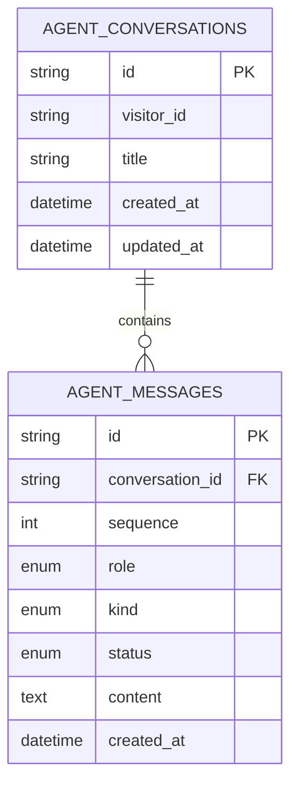
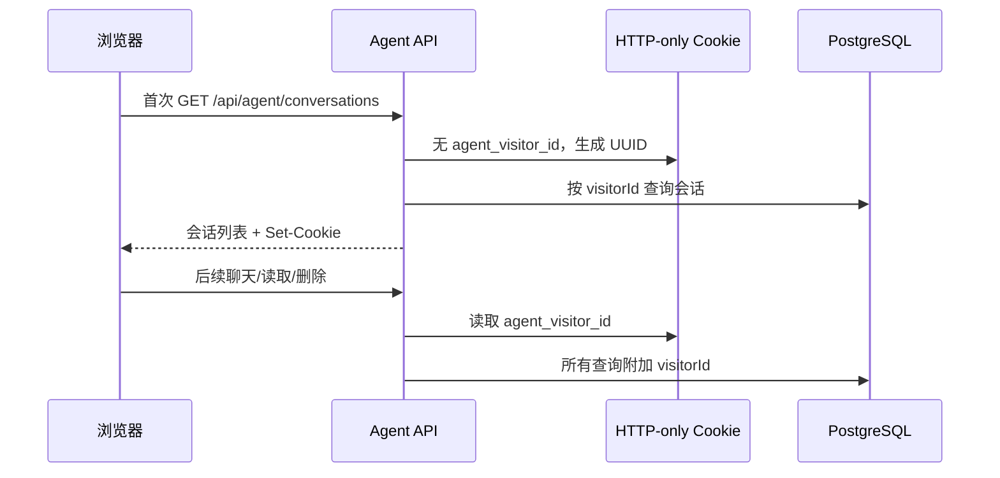
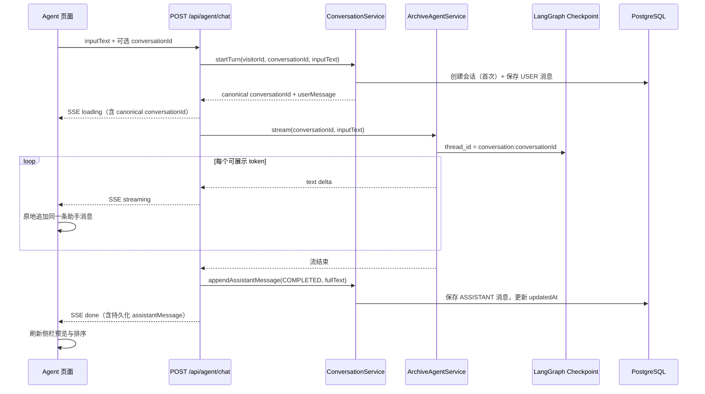
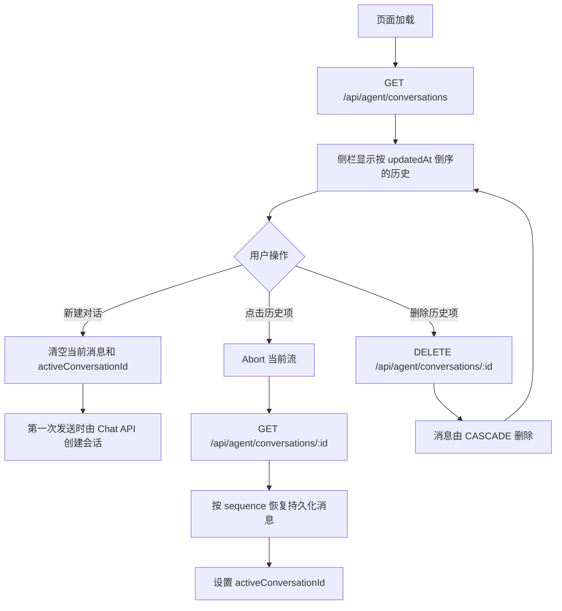

# Agent 会话历史架构

> 状态：第一期实现  
> 目标：让摄影档案 Agent 的对话可在侧栏查看、切换、删除和恢复，同时使 Agent 的 LangGraph 上下文严格按会话隔离。  
> 当前身份策略：登录接入前使用 HTTP-only 匿名访客 cookie；后续以用户身份替换归属键。

## 1. 问题与设计目标

此前 `/agent` 的消息与侧栏历史都只存在浏览器内存：刷新、关闭页面或点击新建对话都会丢失；此外 LangGraph 使用固定 `session-123` 作为 checkpoint thread，所有请求会共享模型上下文。

本设计同时解决两个层面：

1. **应用层历史**：保存并回放用户可见的会话、消息与未来照片引用；
2. **Agent 上下文**：以已授权的 `conversationId` 作为 LangGraph thread，防止不同会话串上下文。

两者不能混用：应用层历史用于 UI、排序、删除和审计；LangGraph checkpoint 仅用于 Agent 的工具循环与短期上下文。

## 2. 核心原则

- 数据库是会话历史的唯一来源，浏览器 state 只是当前会话的渲染缓存。
- 不为每个 token 写数据库：服务端累积流式文本，终态时一次写入助手消息。
- 任何按会话 ID 的读取、写入、删除都必须同时带 `visitorId` 过滤。
- 客户端不提交 `visitorId`；服务端从 HTTP-only cookie 解析或创建。
- 点击侧栏历史只读取已存消息，绝不重新请求模型。
- `conversationId` 先经应用层归属校验，再传给 LangGraph 作为 thread id。

## 3. 数据模型



### `AgentConversation`

| 字段 | 用途 |
| --- | --- |
| `id` | UUID，会话主键，也是 LangGraph thread 的来源 |
| `visitorId` | 登录前的匿名归属键，来自 HTTP-only cookie |
| `title` | 第一条用户问题的短截断标题 |
| `createdAt` / `updatedAt` | 创建与侧栏排序依据 |

### `AgentMessage`

| 字段 | 用途 |
| --- | --- |
| `conversationId` | 会话外键，删除会话时级联删除 |
| `sequence` | 同一会话内稳定排序；不依赖时间戳精度 |
| `role` | `USER` 或 `ASSISTANT` |
| `kind` | 当前为 `TEXT`，为后续 `PHOTO_RESULTS` 预留 |
| `status` | `COMPLETED`、`INTERRUPTED`、`ERROR` |
| `content` | 用户输入或最终助手正文 |

当前数据库已支持文本消息和照片结果消息：`PHOTO_RESULTS` 助手消息保存 `photoTotal` 与有序 `AgentMessagePhoto` 引用。引用只保存 `photoId` 和位置，不保存会过期的签名 URL；历史回放时按 photoId 重新查询并签发图片 URL。

## 4. 身份与授权

### 当前：匿名访客 cookie



Cookie 使用 `HttpOnly`、`SameSite=Lax`、`Path=/`，生产环境启用 `Secure`。它是不可猜测的匿名归属键，不是完整认证方案；不会写入客户端 state、请求 body 或日志。

### 后续：接入登录

登录接入时按以下顺序演进：

1. 在 `AgentConversation` 增加 `userId` 外键；
2. 由认证服务提供用户身份，替代 route 中的匿名 visitor；
3. 首次登录时将该 visitorId 下的会话迁移/绑定给用户；
4. 读取和写入改为 `userId` 过滤；
5. 对分享、团队协作或管理员查看另建显式 ACL，不通过猜测会话 ID 授权。

## 5. 流式写入流程



### 错误与取消

- 模型或工具错误：保存一条 `ERROR` 助手消息，再发送 SSE `error`；
- 浏览器中止：若已经收到部分文本，保存 `INTERRUPTED` 消息；
- SSE `done` 不重复携带完整正文，避免前端将流式内容追加两次；
- token 仅累积在 route 内存，直到终态一次写库，避免高频 Prisma `UPDATE`。

## 6. 历史回放与侧栏交互



前端约束：

- 侧栏项的 React key 使用持久化 `message.id`，不再错误复用临时 `chatId`；
- 删除按钮阻止事件冒泡，避免同时触发会话切换；
- 切换会话会中止旧 SSE，迟到事件不会覆盖新会话 state；
- 页面初始完成访客 cookie 初始化后才允许首次发送，避免列表请求与首次聊天并发创建两个访客归属。

## 7. API 边界

| 接口 | 用途 | 说明 |
| --- | --- | --- |
| `GET /api/agent/conversations` | 侧栏列表 | 最多返回 50 条、按最近活动倒序 |
| `GET /api/agent/conversations/:id` | 历史回放 | 返回会话与按 `sequence` 排序的消息 |
| `DELETE /api/agent/conversations/:id` | 删除会话 | 应用层消息级联删除 |
| `POST /api/agent/chat` | 发送消息并流式回复 | 首次自动创建会话；SSE 返回 canonical id 与持久化消息 |

聊天接口的第一条 `loading` 事件包含 `conversationId` 和持久化后的用户消息。前端将本地乐观消息替换为 canonical id，后续请求都复用该 `conversationId`。

## 8. LangGraph checkpoint 的边界

```text
AgentConversation / AgentMessage
  ├─ 用户可见
  ├─ 可排序、可删除、可恢复
  ├─ 按 visitorId / userId 授权
  └─ 是前端历史的唯一来源

LangGraph PostgresSaver
  ├─ Agent 工具循环与模型上下文
  ├─ thread_id = conversation:<conversationId>
  ├─ 不直接渲染给前端
  └─ 需要单独制定保留与清理策略
```

当前已安装的 checkpoint 包未找到可确认的按 thread 删除公开接口，因此删除会话不会调用未验证的内部 API。后续应根据实际包版本实现 checkpoint TTL 或离线清理任务，避免长期积累；这不影响可见历史删除和新会话的上下文隔离。

## 9. 当前范围与后续计划

### 已覆盖

- 匿名浏览器内会话隔离；
- 文本会话创建、列表、读取、删除与恢复；
- 流式 Agent 终态持久化；
- `PHOTO_RESULTS` 消息的有序 photoId 引用、九宫格展示与历史 URL 重签名；
- conversationId 驱动 LangGraph thread；
- 侧栏选中态、点击读取与删除。

### 下一阶段

1. 会话标题异步摘要：替代第一句截断标题；
2. 会话搜索、分页与归档；
3. 登录迁移与 userId 归属；
4. checkpoint TTL/删除策略；
5. 保存工具摘要和可复用候选集。
