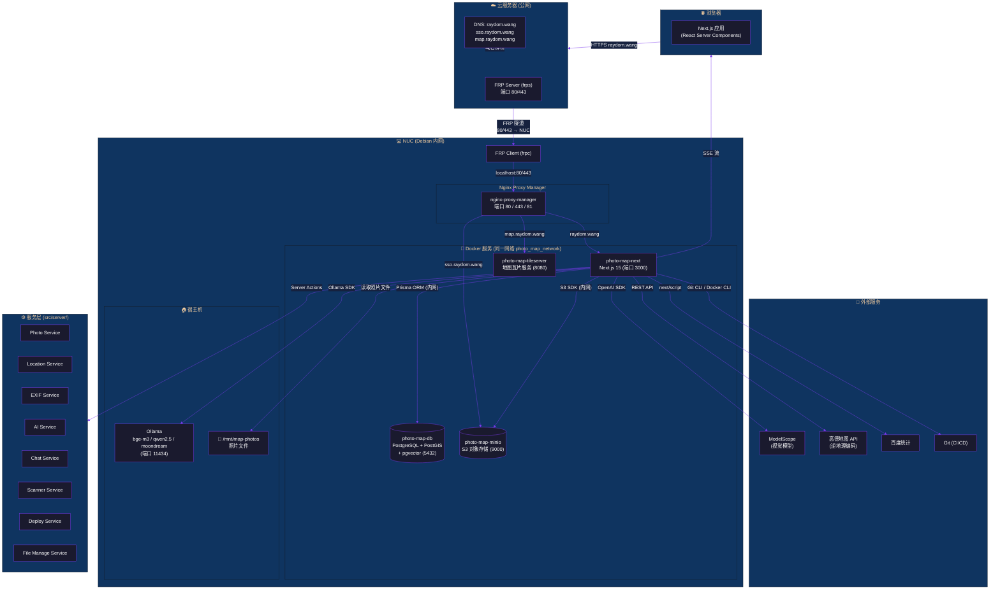
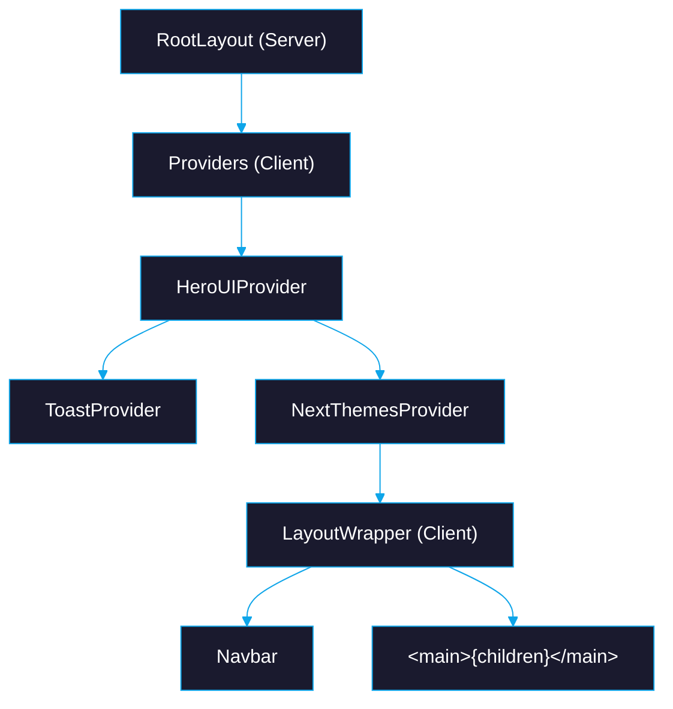
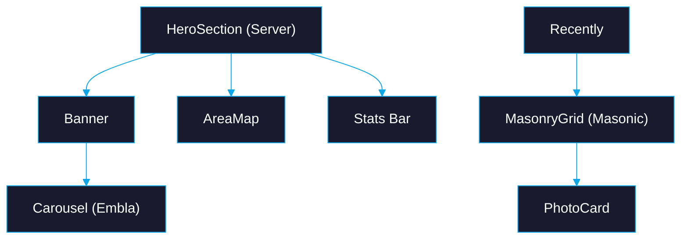
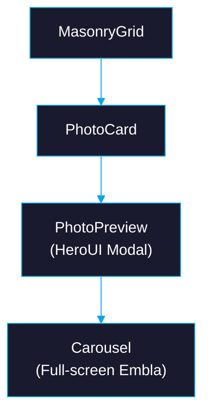
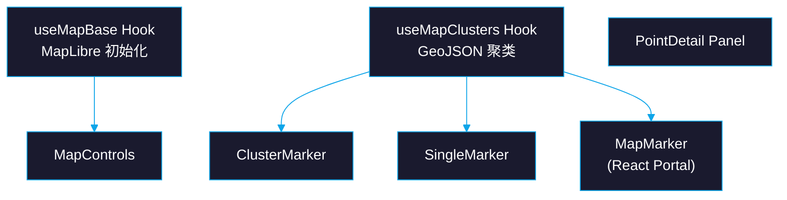
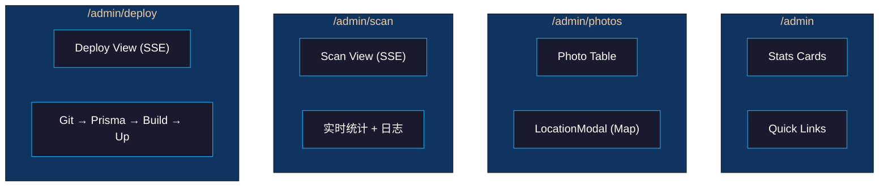
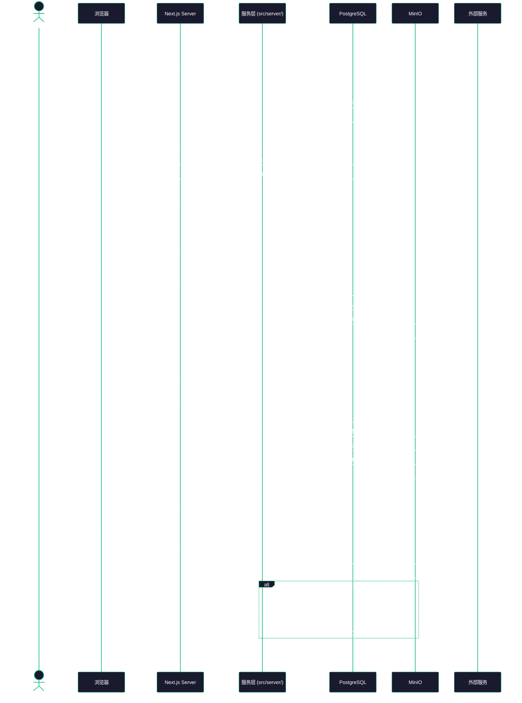
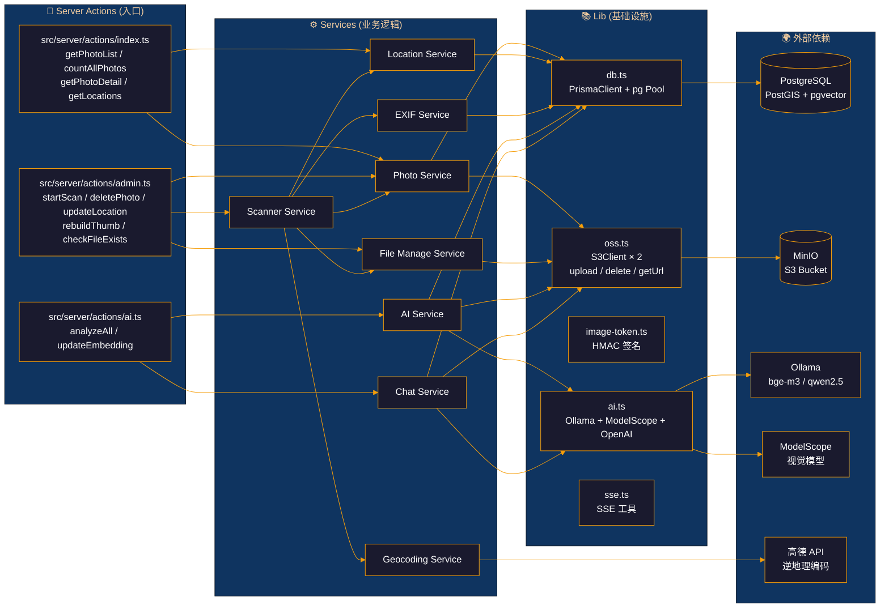
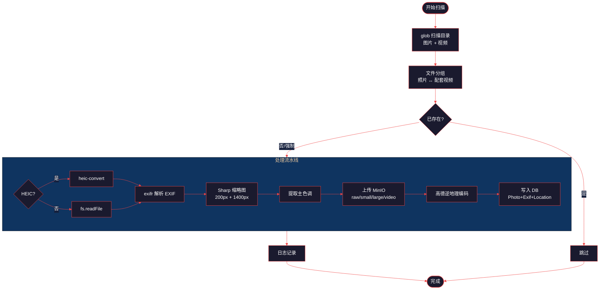
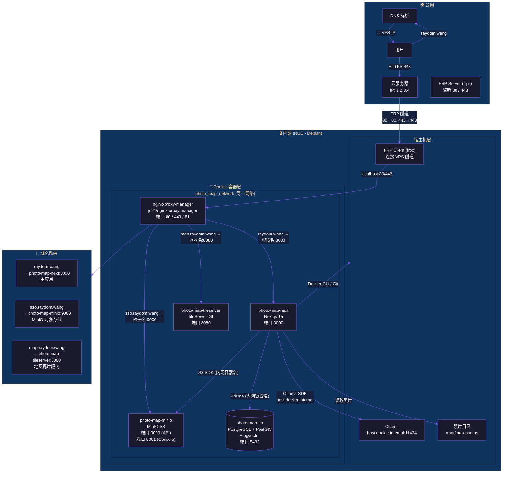

# 项目架构图

> 使用 [Mermaid](https://mermaid.js.org/) 绘制，支持 GitHub、VS Code 等渲染。

---

## 1. 系统总览架构

---

## 2. 前端组件树

### 2a. 布局层级

### 2b. 首页 (/)

### 2c. 照片页 (/photos)

### 2d. 足迹地图 (/footprint)

### 2e. AI 聊天 (/chat)

### 2f. 管理后台 (/admin/*)

---

## 3. 请求与数据流

---

## 4. 后端服务依赖关系

---

## 5. 照片扫描处理流程

---

## 6. 网络拓扑与部署架构

### 6a. 网络拓扑 (FRP + NPM + Docker)

---

## 7. Docker 服务一览

| 容器 | 镜像 | 端口 | 网络 | 作用 |
|------|------|------|------|------|
| `nginx-proxy-manager` | `jc21/nginx-proxy-manager` | 80, 443, 81 | `photo_map_network` | 反向代理 + SSL 终结 |
| `photo-map-next` | 自构建 (Dockerfile) | 3000 | `photo_map_network` | Next.js 全栈应用 |
| `photo-map-db` | 自构建 (db.Dockerfile) | 5432 | `photo_map_network` | PostgreSQL + PostGIS + pgvector |
| `photo-map-minio` | `minio/minio` | 9000, 9001 | `photo_map_network` | S3 兼容对象存储 |
| `photo-map-tileserver` | `maptiler/tileserver-gl` | 8080 | `photo_map_network` | 离线地图瓦片服务 |

### 域名 → 服务映射

NPM 与所有后端容器同属 `photo_map_network`，可直接通过 **容器名** 反代：

| 域名 | NPM 代理目标 | 说明 |
|------|-------------|------|
| `raydom.wang` | `http://photo-map-next:3000` | 主应用 (照片足迹) |
| `sso.raydom.wang` | `http://photo-map-minio:9000` | MinIO S3 API (图片托管) |
| `map.raydom.wang` | `http://photo-map-tileserver:8080` | 地图瓦片服务 (MapLibre 样式) |

### Docker 网络

| 网络 | 类型 | 包含容器 |
|------|------|---------|
| `photo_map_network` | `external: true` | NPM + Next + DB + MinIO + Tile 全部在同一个网络中 |

## 8. 技术栈一览

| 分类 | 技术 | 用途 |
|------|------|------|
| **框架** | Next.js 15 (App Router, Turbopack) | 全栈框架 |
| **语言** | TypeScript 5.6 (strict) | 开发语言 |
| **UI** | HeroUI (NextUI) + Tailwind CSS 4 | 组件库 + 样式 |
| **动画** | Framer Motion 11 | 动效 |
| **地图** | MapLibre GL JS 5 + Turf.js 7 | 地图渲染 + 空间分析 |
| **数据库** | PostgreSQL + PostGIS + pgvector | 数据存储 + 地理 + 向量 |
| **ORM** | Prisma 7 + @prisma/adapter-pg | 数据库 ORM |
| **对象存储** | MinIO (S3) + @aws-sdk/client-s3 | 图片/视频存储 |
| **图片处理** | Sharp + exifr + heic-convert | 缩略图 + EXIF + 格式转换 |
| **AI** | Ollama + ModelScope + Vercel AI SDK | 向量嵌入 + 视觉分析 + 聊天 |
| **流式传输** | ReadableStream (SSE) | 扫描/分析/聊天/部署进度 |
| **地理编码** | 高德地图 API | 坐标→地址 |
| **容器化** | Docker + docker-compose | 部署运行 |
| **内网穿透** | FRP (frps + frpc) | 公网 → 内网隧道 |
| **反向代理** | Nginx Proxy Manager | SSL 终结 + 域名路由 |
