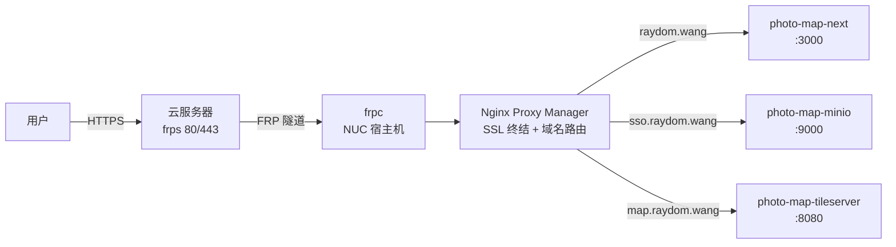
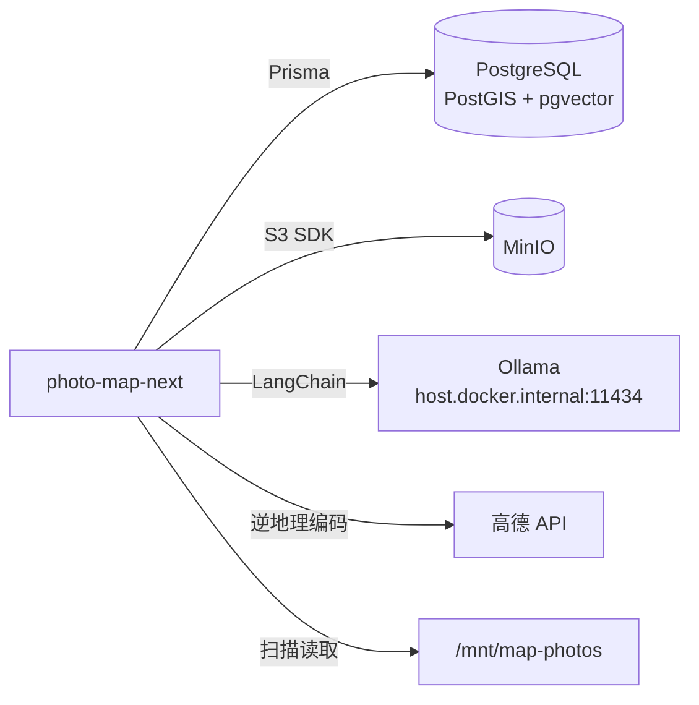
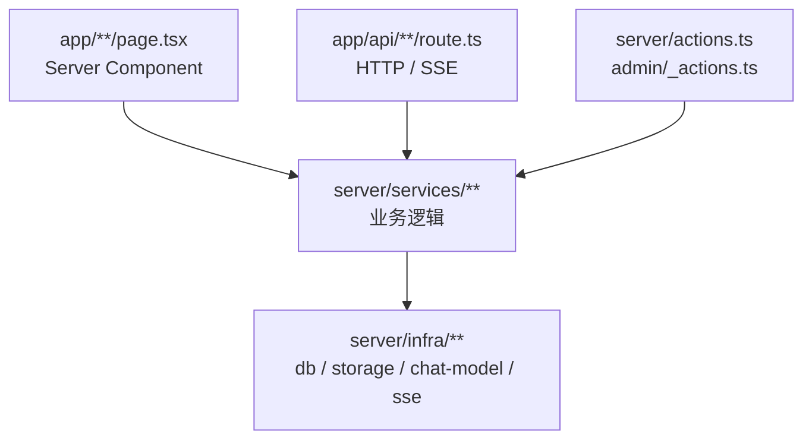
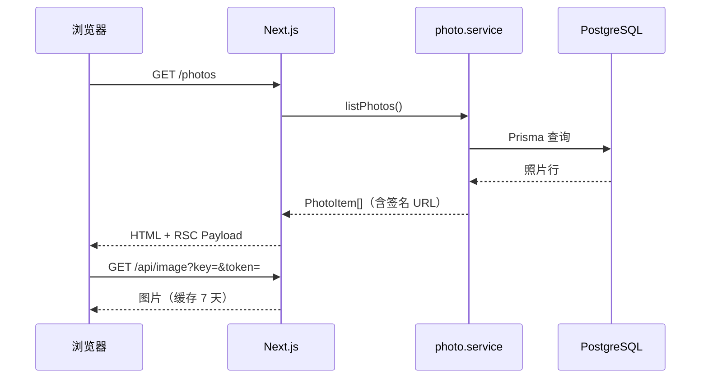
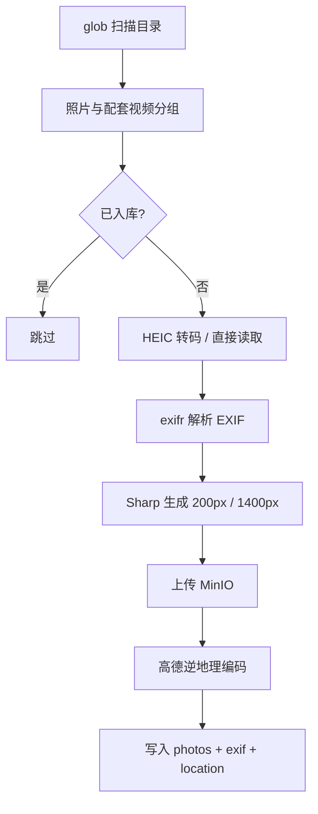
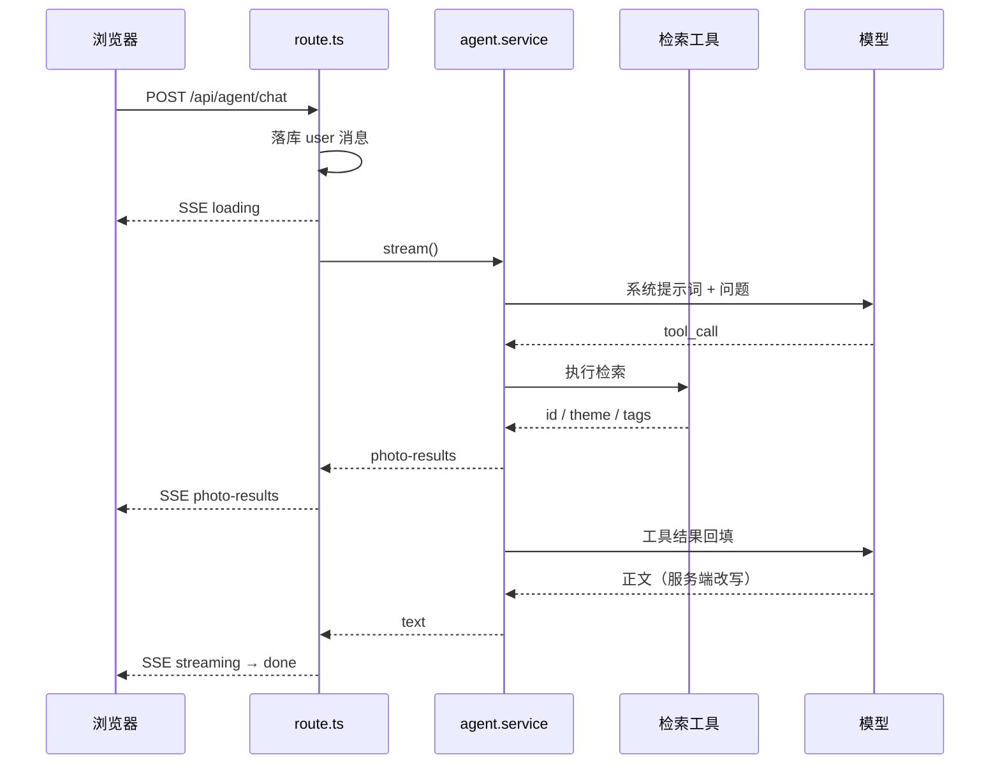
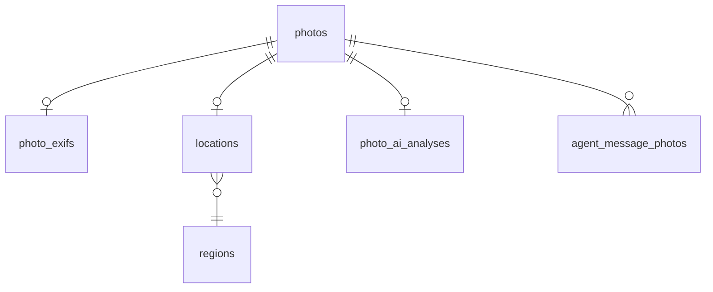
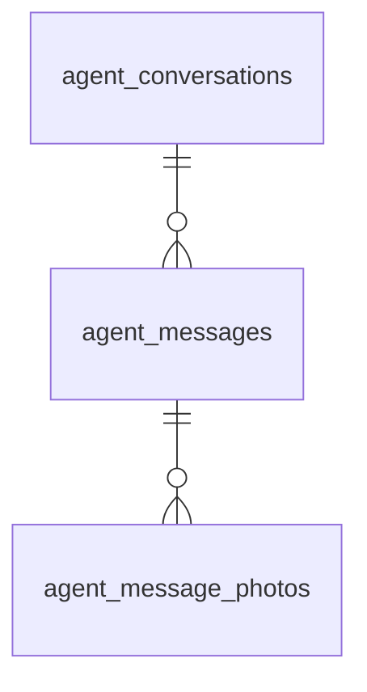

# 项目架构

> Mermaid 图，GitHub / VS Code 可直接渲染。
> 每张图只画一个关注点、节点控制在十个上下 —— 合成一张大图渲染出来字会小到看不清。

---

## 1. 部署拓扑

公网请求怎么进到内网。

```mermaid
graph LR
    User["用户"]
    VPS["云服务器<br/>frps 80/443"]
    FRPC["frpc<br/>NUC 宿主机"]
    NPM["Nginx Proxy Manager<br/>SSL 终结 + 域名路由"]
    App["photo-map-next<br/>:3000"]
    S3["photo-map-minio<br/>:9000"]
    Tile["photo-map-tileserver<br/>:8080"]

    User -->|HTTPS| VPS -->|FRP 隧道| FRPC --> NPM
    NPM -->|raydom.wang| App
    NPM -->|sso.raydom.wang| S3
    NPM -->|map.raydom.wang| Tile
```

NPM 与后端容器同属 `photo_map_network`，所以反代目标直接写容器名。
本仓库的 `docker-compose.yml` 只编排 `photo-map-next`，其余容器单独管理。

## 2. 运行时依赖

应用容器往外连什么。

```mermaid
graph LR
    App["photo-map-next"]
    DB[("PostgreSQL<br/>PostGIS + pgvector")]
    S3[("MinIO")]
    Ollama["Ollama<br/>host.docker.internal:11434"]
    Amap["高德 API"]
    Files["/mnt/map-photos"]

    App -->|Prisma| DB
    App -->|S3 SDK| S3
    App -->|LangChain| Ollama
    App -->|逆地理编码| Amap
    App -->|扫描读取| Files
```

Ollama 跑在宿主机，容器经 `host.docker.internal` 访问（compose 里配 `extra_hosts: host-gateway`），且宿主机需监听 `0.0.0.0`。
模型也可切云端：`*_API_TYPE=openai` 时走 OpenAI 兼容端点，此时不经过 Ollama。

## 3. 代码分层

```mermaid
graph TD
    Page["app/**/page.tsx<br/>Server Component"]
    Route["app/api/**/route.ts<br/>HTTP / SSE"]
    Action["server/actions.ts<br/>admin/_actions.ts"]
    Svc["server/services/**<br/>业务逻辑"]
    Infra["server/infra/**<br/>db / storage / chat-model / sse"]

    Page --> Svc
    Route --> Svc
    Action --> Svc
    Svc --> Infra
```

单向依赖，`services` 不反向依赖 `route` 或前端。

Server Component 直接调 service，不走 Server Action —— 后者会被编译成公开 POST 端点，而两者本就同进程。
客户端组件只能走 `server/actions.ts`（公开读取）、`admin/_actions.ts`（管理操作，逐个 `requireAdmin()`）或 API Route（需要流式响应时）。

## 4. 路由

| 路径 | 类型 | 说明 |
|---|---|---|
| `/` | 页面 | 首页，带导航栏与页脚 |
| `/photos` | 页面 | 照片墙 |
| `/footprint` | 页面 | 足迹地图 |
| `/agent` | 页面 | AI 检索，全屏三栏，不挂站点导航 |
| `/admin` `/admin/photos` `/admin/scan` `/admin/upload` | 页面 | 管理后台，layout 中鉴权后渲染 |
| `/api/agent/chat` | SSE | Agent 对话 |
| `/api/agent/conversations[/:id]` | JSON | 会话列表、详情、删除 |
| `/api/admin/scan` `/api/admin/scan/discover` | SSE / JSON | 扫描入库 |
| `/api/admin/upload` | JSON | 手动上传 |
| `/api/ai/analysis` | SSE | 批量图片分析，`requireAdminResponse` |
| `/api/image` | 二进制 | 图片代理 + HMAC token |

middleware 的 matcher 覆盖 `/admin/*`、`/api/admin/*`、`/api/ai/analysis`；`/api/agent/chat` 不在其中。

## 5. 服务模块

| 模块 | 文件 | 职责 |
|---|---|---|
| 照片 | `services/photo/photo.service.ts` | 列表、详情、签名 URL、脱敏 |
| 地点 | `services/photo/location.service.ts` | 地点、区划聚合 |
| EXIF | `services/photo/exif.service.ts` | 拍摄参数 |
| 入库 | `services/ingestion/scanner.service.ts` | 扫描、缩略图、上传、写库 |
| 地理编码 | `services/ingestion/geocoding.service.ts` | 坐标 → 行政区 |
| 图片分析 | `services/ai/image-analysis/**` | 视觉分析、向量、语义检索、查询改写 |
| Agent | `services/ai/agent/**` | 编排、会话持久化、检索工具 |

`infra/` 放技术设施：`db` / `storage` / `chat-model` / `agent` / `ai-client` / `image-token` / `sse` / `logger` / `env`。
判定规则是「文件里有没有照片、扫描、AI 这类业务概念」—— 有就进 `services/<域>/`，没有就进 `infra/`。

## 6. 页面渲染流程

```mermaid
sequenceDiagram
    participant B as 浏览器
    participant N as Next.js
    participant S as photo.service
    participant DB as PostgreSQL

    B->>N: GET /photos
    N->>S: listPhotos()
    S->>DB: Prisma 查询
    DB-->>S: 照片行
    S-->>N: PhotoItem[]（含签名 URL）
    N-->>B: HTML + RSC Payload
    B->>N: GET /api/image?key=&token=
    N-->>B: 图片（缓存 7 天）
```

图片不发 presigned URL，统一走 `/api/image` 代理加 HMAC token，因此可长期缓存。

## 7. 扫描入库流程

```mermaid
flowchart TD
    Scan["glob 扫描目录"] --> Group["照片与配套视频分组"]
    Group --> Exists{"已入库?"}
    Exists -->|是| Skip["跳过"]
    Exists -->|否| Decode["HEIC 转码 / 直接读取"]
    Decode --> Exif["exifr 解析 EXIF"]
    Exif --> Thumb["Sharp 生成 200px / 1400px"]
    Thumb --> Upload["上传 MinIO"]
    Upload --> Geo["高德逆地理编码"]
    Geo --> Write["写入 photos + exif + location"]
```

AI 分析是独立流程，由 `/api/ai/analysis` 触发，不在扫描链路里。

## 8. Agent 对话流程

```mermaid
sequenceDiagram
    participant B as 浏览器
    participant R as route.ts
    participant A as agent.service
    participant T as 检索工具
    participant M as 模型

    B->>R: POST /api/agent/chat
    R->>R: 落库 user 消息
    R-->>B: SSE loading
    R->>A: stream()
    A->>M: 系统提示词 + 问题
    M-->>A: tool_call
    A->>T: 执行检索
    T-->>A: id / theme / tags
    A-->>R: photo-results
    R-->>B: SSE photo-results
    A->>M: 工具结果回填
    M-->>A: 正文（服务端改写）
    A-->>R: text
    R-->>B: SSE streaming → done
```

细节见 `AGENT_DEVELOPMENT_PLAN.md`：五个工具的入参、正文接管的三个分支、相似度阈值、性能实测。

## 9. 数据模型

```mermaid
erDiagram
    photos ||--o| photo_exifs : ""
    photos ||--o| locations : ""
    photos ||--o| photo_ai_analyses : ""
    locations }o--|| regions : ""
    photos ||--o{ agent_message_photos : ""
```

```mermaid
erDiagram
    agent_conversations ||--o{ agent_messages : ""
    agent_messages ||--o{ agent_message_photos : ""
```

三张一对一表拆开的理由见 `REFACTOR.md` 附录 A。
`photo_ai_analyses` 存两个 `vector(1024)`（描述向量、标签向量）。
LangGraph 的 `checkpoint*` 四张表由 `PostgresSaver` 维护，不在 Prisma schema 内。

## 10. Docker 与域名

| 容器 | 镜像 | 端口 | 作用 |
|---|---|---|---|
| `nginx-proxy-manager` | `jc21/nginx-proxy-manager` | 80 / 443 / 81 | 反代 + SSL |
| `photo-map-next` | 自构建 | 3000 | 应用 |
| `photo-map-db` | 自构建 | 5432 | PostgreSQL + PostGIS + pgvector |
| `photo-map-minio` | `minio/minio` | 9000 / 9001 | 对象存储 |
| `photo-map-tileserver` | `maptiler/tileserver-gl` | 8080 | 地图瓦片 |

| 域名 | 代理目标 |
|---|---|
| `raydom.wang` | `photo-map-next:3000` |
| `sso.raydom.wang` | `photo-map-minio:9000` |
| `map.raydom.wang` | `photo-map-tileserver:8080` |

全部在 `photo_map_network`（`external: true`）。

SSE 接口需在 NPM 的 Advanced 里放宽读超时：`proxy_read_timeout 600s` + `proxy_buffering off`，否则 Agent 的静默期会被判超时断连。

## 11. 技术栈

| 分类 | 选型 |
|---|---|
| 框架 | Next.js 15.3（App Router、standalone 产物） |
| 语言 | TypeScript 5.6 strict |
| UI | HeroUI + Tailwind CSS 4 |
| 动效 | motion 13 |
| 地图 | MapLibre GL 5 + Turf 7 |
| 数据库 | PostgreSQL + PostGIS + pgvector |
| ORM | Prisma 7 + `@prisma/adapter-pg` |
| 对象存储 | MinIO + `@aws-sdk/client-s3` |
| 图片处理 | Sharp + exifr + heic-convert |
| AI 编排 | LangChain 1.5 / LangGraph 1.4 + `@langchain/langgraph-checkpoint-postgres` |
| 模型接入 | `@langchain/ollama`、`@langchain/openai`（兼容端点，覆盖百炼与魔搭） |
| 流式 | `ReadableStream` SSE（扫描、分析、对话） |
| 校验 | zod 4 |
| 部署 | Docker + FRP 内网穿透 + Nginx Proxy Manager |
